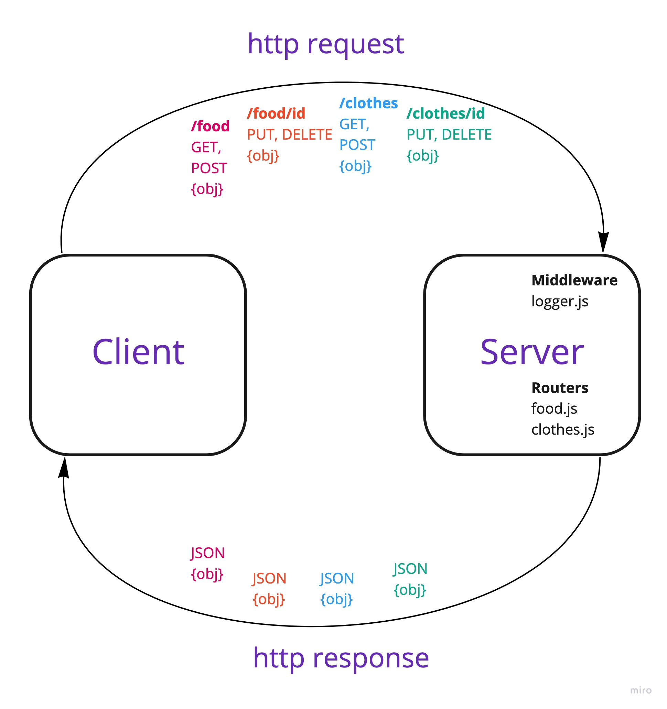

# LAB - Class 03

## Project: Basic API Server

### Author: Brendan Smith

### Links and Resources

- [ci/cd](https://github.com/brendigler/basic-api-server/actions)
- [server url](https://brsmith-basic-api-server.herokuapp.com/)
- [Pull Request](https://github.com/brendigler/basic-api-server/pull/1)

### Setup

#### `.env` requirements

- `PORT` - Port Number

#### How to initialize/run your application

- clone to local repo
- `npm install`
- `npm start`

#### Tests

- Run tests with `npm test`
- Logger test was copied directly from class notes

#### UML / Application Wiring Diagram

